# Testing

> [!NOTE]
> Return back to the [README.md](README.md) file.


## Code Validation


### HTML

I have used the recommended [HTML W3C Validator](https://validator.w3.org) to validate all of my HTML files.

| Directory | File | URL | Screenshot | Notes |
| --- | --- | --- | --- | --- |
| home | [index.html](https://github.com/MaejorS/project5/blob/main/home/templates/home/index.html) | | 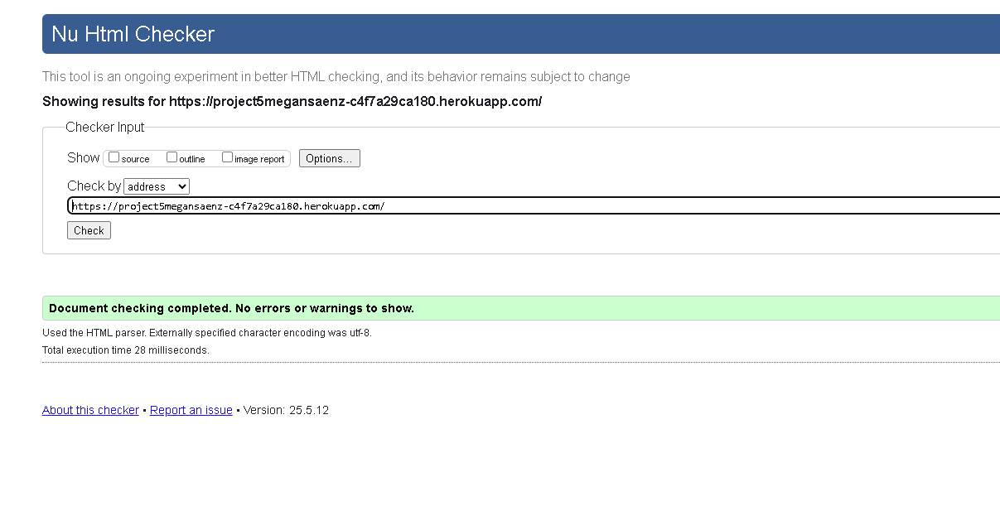 | |
| templates | [404.html](https://github.com/MaejorS/project5/blob/main/templates/404.html) | | 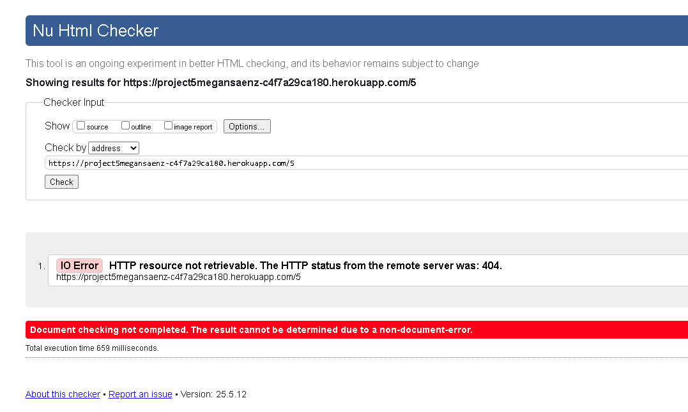 |  |
| templates | [customer_profile.html](https://github.com/MaejorS/project5/blob/main/templates/checkout/customer_profile.html) | | 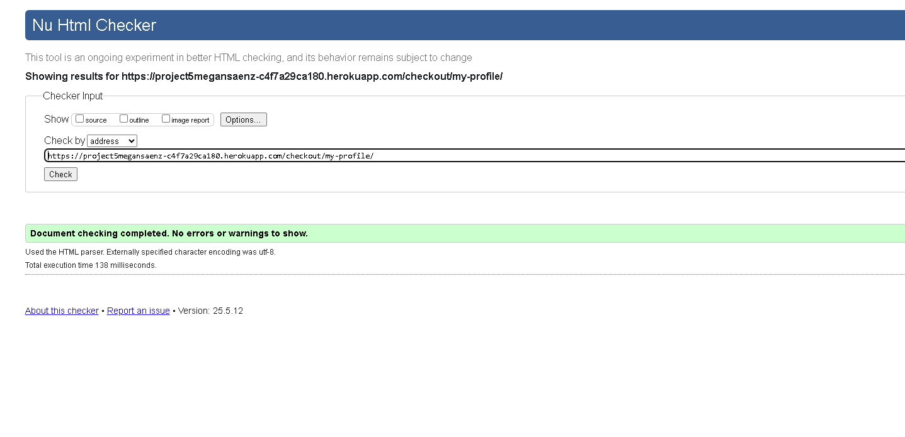 | |
| templates | [product_detail.html](https://github.com/MaejorS/project5/blob/main/templates/products/product_detail.html) | | 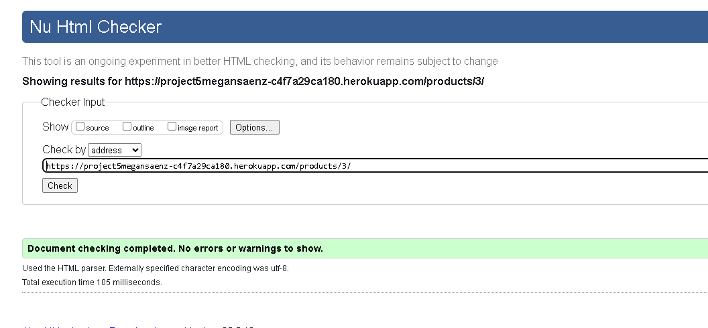 | |


### CSS

⚠️ INSTRUCTIONS ⚠️

1. [*recommended*] If you are using the live deployed site, use this link: https://jigsaw.w3.org/css-validator/#validate_by_uri
2. If you are copying/pasting your CSS code, use this link: https://jigsaw.w3.org/css-validator/#validate_by_input

It's recommended to validate the live site for your primary CSS file on the deployed URL. This will give you a custom URL as well, which you can use below on your testing documentation. It makes it easier to return back to a page for validating it again in the future. The URL will look something like this:

- https://jigsaw.w3.org/css-validator/validator?uri=https://project5megansaenz-c4f7a29ca180.herokuapp.com

If you have additional/multiple CSS files, then individual "[validation by input](https://jigsaw.w3.org/css-validator/#validate_by_input)" is recommended for the extra CSS files.

**IMPORTANT**: Third-Party tools

If you're using external libraries/frameworks (e.g: Bootstrap, Materialize, Font Awesome, etc.), then sometimes the tool will attempt to also validate these, even though it's not part of your own actual code that you wrote. You are not required to validate the external libraries or frameworks!

⚠️ --- END --- ⚠️

I have used the recommended [CSS Jigsaw Validator](https://jigsaw.w3.org/css-validator) to validate all of my CSS files.

| Directory | File | URL | Screenshot | Notes |
| --- | --- | --- | --- | --- |
| static | [base.css](https://github.com/MaejorS/project5/blob/main/static/css/base.css) |  | 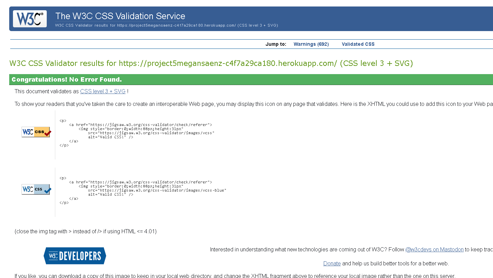 | |

**IMPORTANT**: Django settings

The Django `settings.py` file comes with 4 lines that are quite long, and will throw the `E501 line too long` error. This is default behavior, but can be fixed by adding the "`  # noqa`" comment at the end of those lines.

```python
AUTH_PASSWORD_VALIDATORS = [
    {
        "NAME": "django.contrib.auth.password_validation.UserAttributeSimilarityValidator",  # noqa
    },
    {
        "NAME": "django.contrib.auth.password_validation.MinimumLengthValidator",  # noqa
    },
    {
        "NAME": "django.contrib.auth.password_validation.CommonPasswordValidator",  # noqa
    },
    {
        "NAME": "django.contrib.auth.password_validation.NumericPasswordValidator",  # noqa
    },
]
```

**IMPORTANT**: *migration* and *pycache* files

You do not have to validate files from the `migrations/` or `pycache/` folders! Ignore these `.py` files, and validate just the files that you've created or modified.

🛑 --- END --- 🛑

I have used the recommended [PEP8 CI Python Linter](https://pep8ci.herokuapp.com) to validate all of my Python files.

| 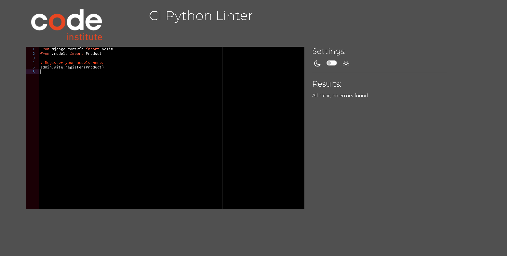 |
| 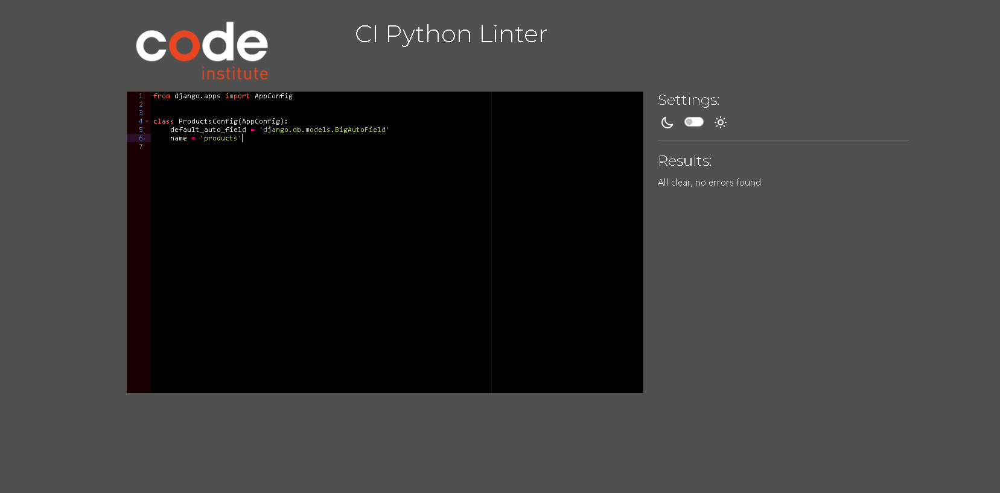 |
|  |
| 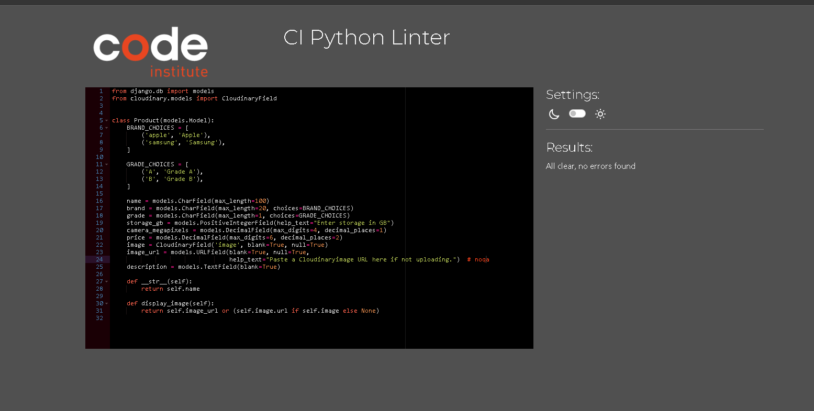 |


## Responsiveness


I've tested my deployed project to check for responsiveness issues.

| Register | | 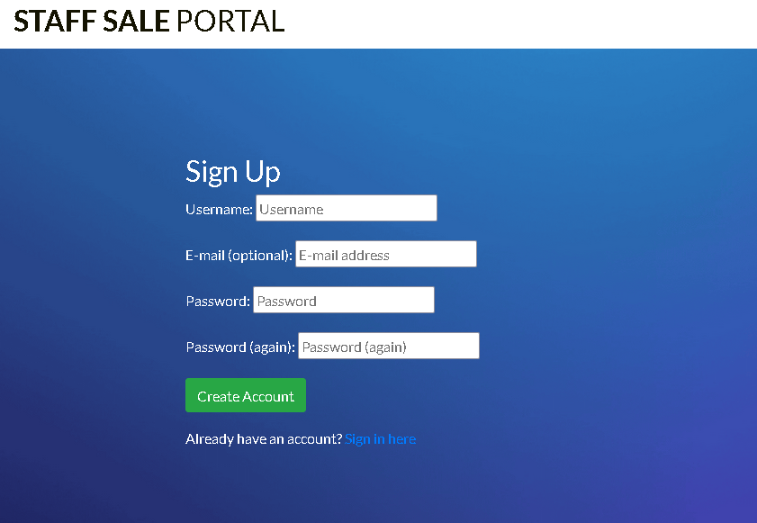 |
| Login |  | 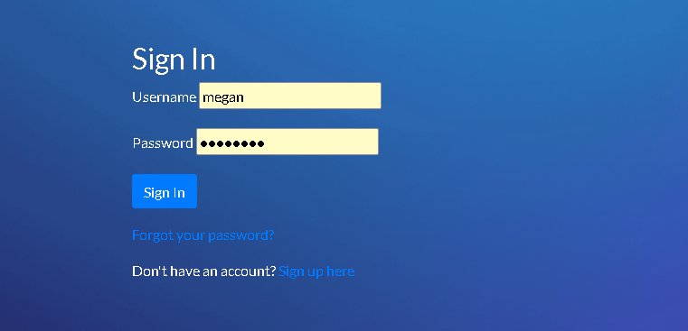 |
| Logout |  |  |
| Device Details | | 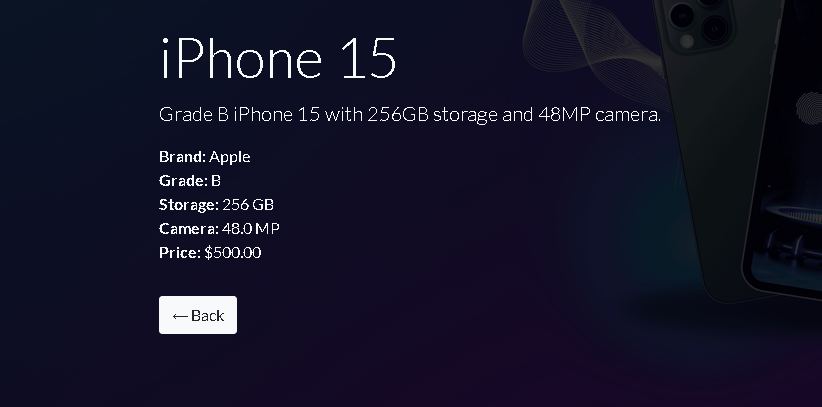 |
| Checkout |  | 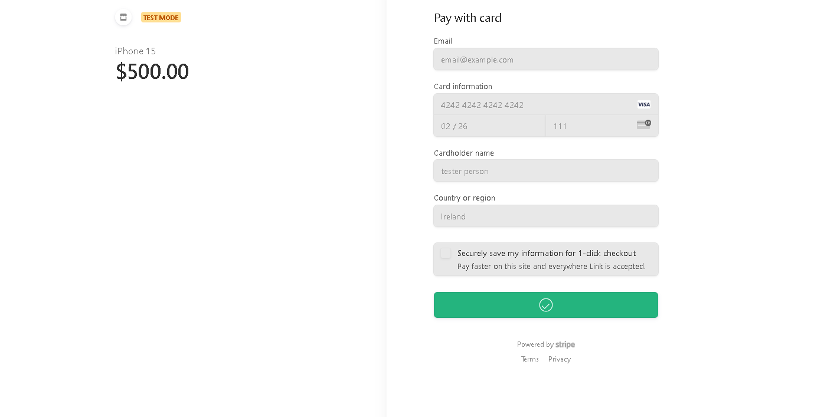 |
| Order Confirmation | | 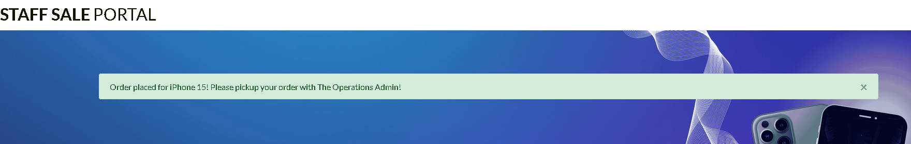 |
| Profile Management |  | 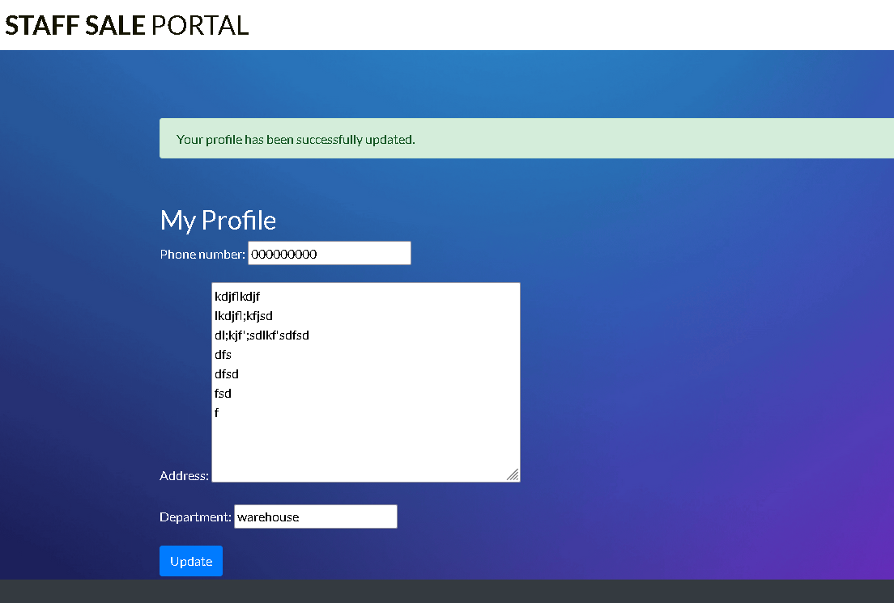 |
| Product Management | | 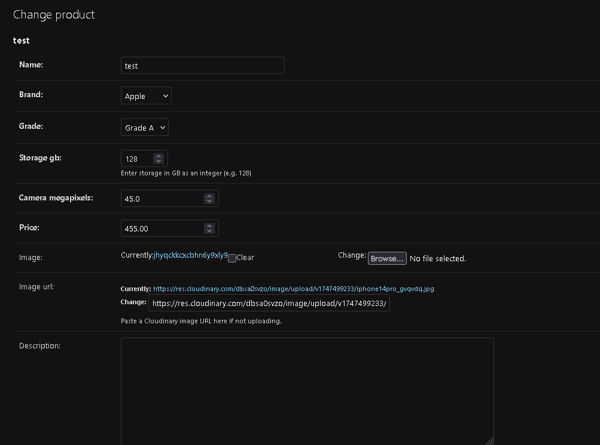 |
| Newsletter | | 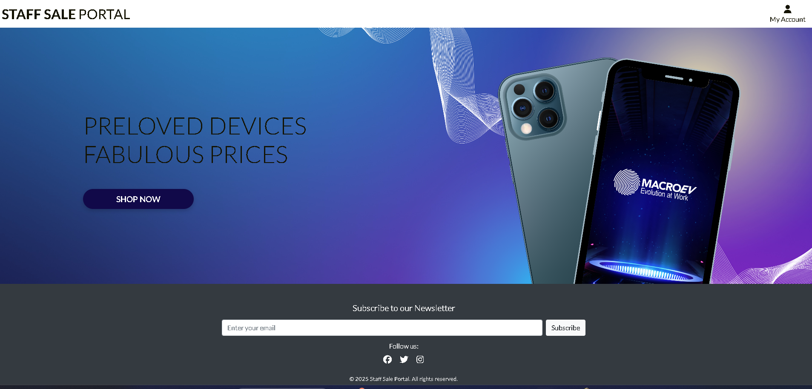 |
| Heroku Deployment | |  |
| SEO |  | 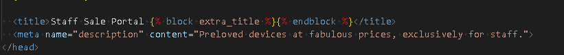 |
| Marketing | |  |
| 404 | |  |

## Browser Compatibility

⚠️ INSTRUCTIONS ⚠️

Use this space to discuss testing the live/deployed site on various browsers. Consider testing at least 3 different browsers, if available on your system. You DO NOT need to use all of the browsers below, just pick any 3 (minimum).

Recommended browsers to consider:
- [Chrome](https://www.google.com/chrome)
- [Firefox (Developer Edition)](https://www.mozilla.org/firefox/developer)
- [Edge](https://www.microsoft.com/edge)
- [Safari](https://support.apple.com/downloads/safari)
- [Brave](https://brave.com/download)
- [Opera](https://www.opera.com/download)

**IMPORTANT**: You must provide screenshots of the browsers you've tested, to "prove" that you've actually tested them.

Please note, there are services out there that can test multiple browser compatibilities at the same time. Some of these are paid services, but some are free. If you use these, you must provide a link to the source used for attribution, and multiple screenshots of the results.

⚠️ --- END --- ⚠️

I've tested my deployed project on multiple browsers to check for compatibility issues.

| Page | Chrome | Firefox | Safari | Notes |
| --- | --- | --- | --- | --- |
| Register |  |  |  | Works as expected |
| Login |  |  |  | Works as expected |
| Profile |  |  |  | Works as expected |
| Home |  |  |  | Works as expected |
| Products |  |  |  | Works as expected |
| Product Details |  |  |  | Works as expected |
| Bag |  |  |  | Works as expected |
| Checkout |  |  |  | Works as expected |
| Checkout Success |  |  |  | Works as expected |
| Add Product |  |  |  | Works as expected |
| Edit Product |  |  |  | Works as expected |
| Newsletter |  |  |  | Works as expected |
| Contact |  |  |  | Works as expected |
| 404 |  |  |  | Works as expected |

## Lighthouse Audit

⚠️ INSTRUCTIONS ⚠️

Use this space to discuss testing the live/deployed site's Lighthouse Audit reports. Avoid testing the local version (Gitpod/VSCode/etc.), as this can have knock-on effects for performance. If you don't have "Lighthouse" in your Developer Tools, it can be added as an [extension](https://chrome.google.com/webstore/detail/lighthouse/blipmdconlkpinefehnmjammfjpmpbjk).

Unless your project is a single-page application (SPA), you should test Lighthouse Audit results for all of your pages, for both *mobile* and *desktop*.

**IMPORTANT**: You must provide screenshots of the results, to "prove" that you've actually tested them.

⚠️ --- END --- ⚠️

I've tested my deployed project using the Lighthouse Audit tool to check for any major issues. Some warnings are outside of my control, and mobile results tend to be lower than desktop.

| Page | Mobile | Desktop |
| --- | --- | --- |
| Register |  |  |
| Login |  |  |
| Profile |  |  |
| Home |  |  |
| Products |  |  |
| Product Details |  |  |
| Bag |  |  |
| Checkout |  |  |
| Checkout Success |  |  |
| Add Product |  |  |
| Edit Product |  |  |
| Newsletter |  |  |
| Contact |  |  |
| 404 |  |  |


## Bugs

### Fixed Bugs

I ran into a lot of error working on this project. Many of which I did not capture as I spent a lot of time trying to fix them. Most of them dealt with typos or a migration not pushing through to Heroku for some reason. Often, I'd have to install Heroku's CLI and push to Heroku main in order to get the migrations through. 

| 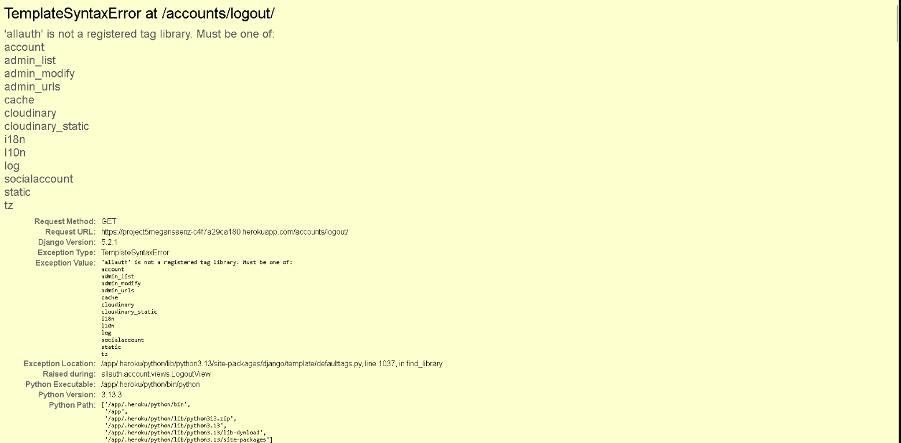 |
| 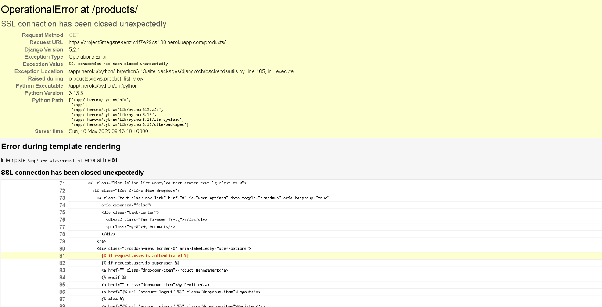 |

### Unfixed Bugs

⚠️ INSTRUCTIONS ⚠️

One bug I've done my best to fix but can't seem to find the root is with Admin loging. It seems the database wipes the authenticated user, requiring me to create a new superuser every few days.


