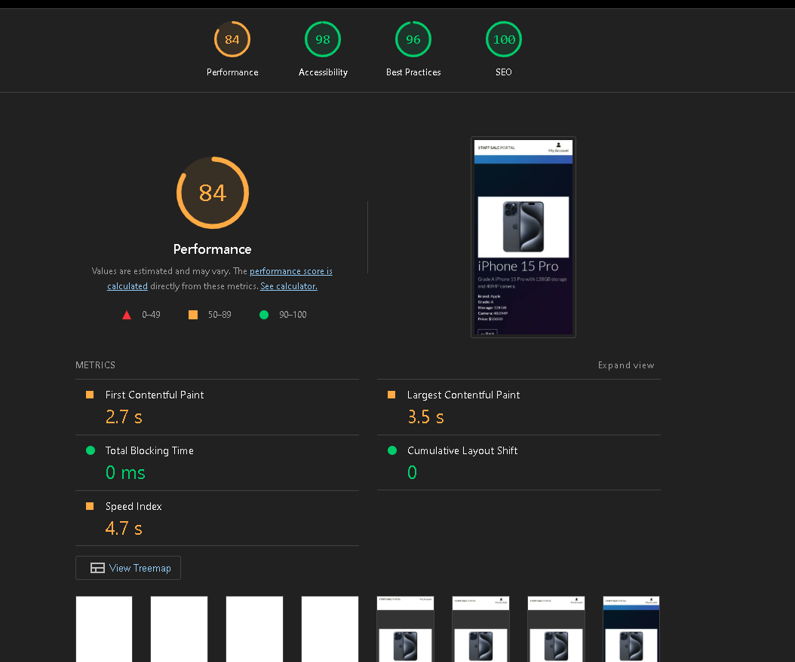
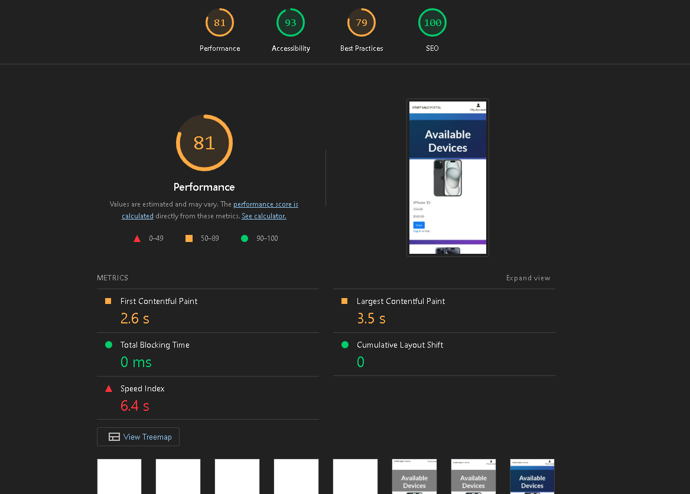
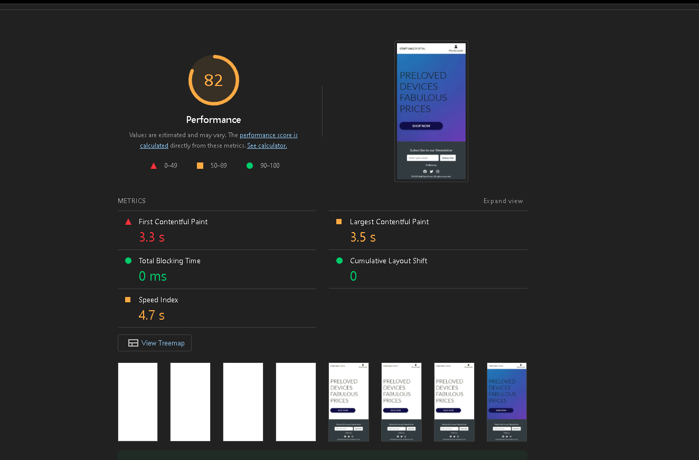

# Testing

> [!NOTE]
> Return back to the [README.md](README.md) file.


## Code Validation


### HTML

I have used the recommended [HTML W3C Validator](https://validator.w3.org) to validate all of my HTML files.

| Directory | File | URL | Screenshot | Notes |
| --- | --- | --- | --- | --- |
| home | [index.html](https://github.com/MaejorS/project5/blob/main/home/templates/home/index.html) | |  | |
| templates | [404.html](https://github.com/MaejorS/project5/blob/main/templates/404.html) | |  |  |
| templates | [customer_profile.html](https://github.com/MaejorS/project5/blob/main/templates/checkout/customer_profile.html) | |  | |
| templates | [product_detail.html](https://github.com/MaejorS/project5/blob/main/templates/products/product_detail.html) | |  | |


### CSS

I have used the recommended [CSS Jigsaw Validator](https://jigsaw.w3.org/css-validator) to validate all of my CSS files.

| Directory | File | URL | Screenshot | Notes |
| --- | --- | --- | --- | --- |
| static | [base.css](https://github.com/MaejorS/project5/blob/main/static/css/base.css) |  |  | |

**IMPORTANT**: Django settings

The Django `settings.py` file comes with 4 lines that are quite long, and will throw the `E501 line too long` error. This is default behavior, but can be fixed by adding the "`  # noqa`" comment at the end of those lines.

```python
AUTH_PASSWORD_VALIDATORS = [
    {
        "NAME": "django.contrib.auth.password_validation.UserAttributeSimilarityValidator",  # noqa
    },
    {
        "NAME": "django.contrib.auth.password_validation.MinimumLengthValidator",  # noqa
    },
    {
        "NAME": "django.contrib.auth.password_validation.CommonPasswordValidator",  # noqa
    },
    {
        "NAME": "django.contrib.auth.password_validation.NumericPasswordValidator",  # noqa
    },
]
```

**IMPORTANT**: *migration* and *pycache* files


I have used the recommended [PEP8 CI Python Linter](https://pep8ci.herokuapp.com) to validate all of my Python files.

|  |
|  |
|  |
|  |


## Responsiveness


I've tested my deployed project to check for responsiveness issues.


## Lighthouse Audit

I've tested my deployed project using the Lighthouse Audit tool to check for any major issues. Some warnings are outside of my control, and mobile results tend to be lower than desktop.

| Page | Mobile | Desktop |
| --- | --- | --- |
| |  |
| |  |
| |  |


## Bugs

### Fixed Bugs

I ran into a lot of error working on this project. Many of which I did not capture as I spent a lot of time trying to fix them. Most of them dealt with typos or a migration not pushing through to Heroku for some reason. Often, I'd have to install Heroku's CLI and push to Heroku main in order to get the migrations through. 

|  |
|  |

### Unfixed Bugs


One bug I've done my best to fix but can't seem to find the root is with Admin loging. It seems the database wipes the authenticated user, requiring me to create a new superuser every few days.


